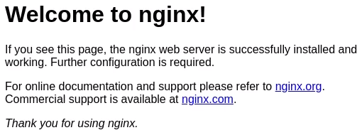

# Start2Impact Django&Redis project: Blockchain bulletin board
Online bulletin board that writes posts on the Ropsten network blockchain.
The web-app provides a user interface and API endpoints with the following features:

#### User interface
1) User registration and authentication.
2) Write a new post and view all posts written by users.
3) User profile.
4) User list and statistics (Administrators only).

#### API endpoints
1) ```/api/rest-auth/registration/```: User registration via token.
2) ```/api/rest-auth/login/```: Authentication via token.
3) ```/api/new-post/```: Create a new post.
4) ```/api/posts/```: Retrieve all posts written by users.
5) ```/api/posts/?search=word_to_search_for```: Retrieve the number of posts that contain a certain word.
6) ```/api/posts/latest/```: Retrieve all posts published in the last hour.

The web-app also integrates a filter for posts containing the word 'hack', performs a daily report logging the use of endpoints by users and keeps track of the last IP with which users logged in to notify if it is different from the previous one.

#### Live demo: [SocialDex](#) (Temporarily not available)

## Frameworks and technologies used:
#### Frameworks
- [Django](https://docs.djangoproject.com/en/3.2/) - Back-end
- [Django REST Framework](https://www.django-rest-framework.org/) - APIs
- [Bootstrap](https://getbootstrap.com/docs/4.6/getting-started/introduction/) - Front-end

#### Databases
- [SQLite](https://sqlite.org/docs.html) - Storage and web-app structure
- [Redis](https://redis.io/documentation) - Temporary logs

#### Technologies
- [Celery](https://docs.celeryproject.org/en/stable/#) - Scheduled tasks

## Setup for production
#### Clone the repository and install some required packages:
```
$ git clone https://github.com/pogginicolo98/start2impact_social-dex
$ sudo add-apt-repository ppa:deadsnakes/ppa
$ sudo apt-get update
$ sudo apt-get install python3.9
$ sudo apt-get install gcc
$ sudo apt-get install python3-virtualenv
```

#### Configure the virtual environment:
```
start2impact_social-dex$ virtualenv venv -p python3.9
start2impact_social-dex$ source venv/bin/activate
(venv) start2impact_social-dex$ pip install -r requirements.txt
```

#### Install Redis:
```
start2impact_social-dex$ wget https://download.redis.io/releases/redis-6.2.5.tar.gz
start2impact_social-dex$ tar xzf redis-6.2.5.tar.gz
start2impact_social-dex$ cd redis-6.2.5
start2impact_social-dex/redis-6.2.5$ sudo make
start2impact_social-dex/redis-6.2.5$ sudo make test
```

Run Redis in then background using ```$ screen``` then press ```ENTER```, then ```start2impact_social-dex/redis-6.2.5$ src/redis-server```, then press ```CTRL+A``` and finally press ```D```. (These commands must be executed every time the server is restarted)

#### Setup and test django project:
First of all populate ```start2impact_social-dex/setup/password_empty.py``` with your keys.
```
start2impact_social-dex$ mv setup/password_empty.py social_dex/password.py
(venv) start2impact_social-dex/social_dex$ python manage.py runserver
(venv) start2impact_social-dex/social_dex$ python manage.py makemigrations
(venv) start2impact_social-dex/social_dex$ python manage.py migrate
(venv) start2impact_social-dex/social_dex$ python manage.py test
```

#### Install and configure Gunicorn:
```
(venv) start2impact_social-dex$ pip install gunicorn
start2impact_social-dex$ mv setup/gunicorn_start.bash .
start2impact_social-dex$ sudo chmod u+x gunicorn_start.bash
```

#### Install and configure Supervisor:
```
$ sudo apt-get install supervisor
start2impact_social-dex$ sudo mv setup/social_dex_supervisor.conf /etc/supervisor/conf.d/social_dex.conf
start2impact_social-dex$ mkdir logs
start2impact_social-dex$ mv setup/gunicorn_supervisor.log logs/
$ sudo systemcl restart supervisor
$ sudo systemcl enable supervisor
```
Check if Supervisor is working properly: ```$ sudo supervisorctl status social_dex```

#### Install and configure Nginx:
```
$ sudo apt-get install nginx
start2impact_social-dex$ mkdir static-serve
$ sudo rm /etc/nginx/sites-available/default
$ sudo rm /etc/nginx/sites-enabled/default
start2impact_social-dex$ sudo mv /setup/social_dex_nginx.conf /etc/nginx/sites-available/social_dex.conf
$ sudo ln -s /etc/nginx/sites-available/social_dex.conf /etc/nginx/sites-enabled/social_dex.conf
(venv) start2impact_social-dex/social_dex$ python manage.py collectstatic
$ sudo service nginx start
```
Check if Nginx is working properly by accessing to the server via browser. You should see a message like this:


If Nginx is working properly restart it with: ```$ sudo service nginx restart```. Now you should see the homepage and the web-app should working properly.

#### Enable scheduled tasks:
```$ screen``` then press ```ENTER```, then ```(venv) start2impact_social-dex/social_dex$ celery -A social_dex worker -B -l INFO```, then press ```CTRL+A``` and finally press ```D```. (These commands must be executed every time the server is restarted)
